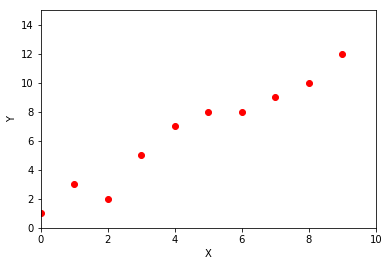
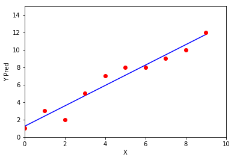
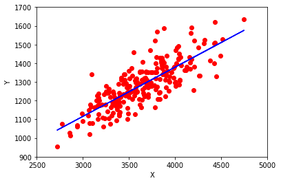

## Regression :

Regression is the **Predictive Modelling** for the **continous** values of input , by creating a function that enables relation between Independent Variable and Dependent Variable . 

Predicting a person’s annual income from their education, their age, and where they live is anexample of a regression task. When predicting income, the predicted value is an amount, and can be any number in a given range. Another example of a regression task is predicting the yield of a corn farm given attributes such as previous yields,weather, and number of employees working on the farm. 

The yield again can be an arbitrary number.
Market Forecasting , Price Prediction , Population Growth Prediction are some of applications for regression model .

### Usage :

1. Strength of the effect of Independent Variable (x) over the Dependent Variable (y) [ y = mx+c ]

2. Forecasting an effect 

3. Trend forecasting (Value of the land after some years)

## Linear Regression :

   Linear regression is the method of finding the best fit line over the available points in data . linear regression could be simply represented as 
    
    y = mx + c 
    
   y - Dependent Variable <br>
   m - Slope <br>
   x - Independent Variable <br> 
   c - Intercept <br>
   
   It creates a corelation between the X and Y . 
   Accuracy is been calculated by **R squared** , **RMSE** Root Mean Squared Error . 
   
   ### When to use Linear Regression ?
   
   Linear Regression , could be used in following scenarios 
   1. When the data values are continous 
   2. Data Quality - Quality of the data is good ( Minimum no. of outliers , no null values ) These could be enhanced by Exploratory Data analysis EDA ( We will cover that soon ) .
   For now , assume the data with minimum outliers and no null values . 
   
   3. Low Computational Complexity .
   4. If the data could be represented in Simple Mathematical Equation .

### Applications of Linear Regression :
<ul>
<li> Evaluating trends and sales estimates .</li>
<li> Analysing the Impact of Price Changes .</li>
<li> Assessing the Risk in organization .</li>
<p> Consider the data of repaying the loan , its noted that people who are young , having job has higher probability of repaying the loan when compared to jobless , old people .</p>
 </ul>
 


     
     

In the above image , blue dots are the data and the red line is the **best fit line** .
Also the good algorithm has lower error , so now we have to calculate the error . 

**Error is the difference between the predicted value and the actual value ** 


Here the **orange colored dots are the difference between the actual point and the original point  .** 

For better understanding lets have some small data and play with it . 

<table>
<tr> <th>X</th><td>0</td>  
<td>1</td> 
<td>2</td>  
<td>3</td> 
<td>4</td>  
<td>5</td> 
<td>6</td>  
<td>7</td> 

<td>8</td>  
<td>9</td></tr>
<tr>
<th>Y</th> 
<td>1</td>
<td>3</td>
<td>2</td>
<td>5</td>
<td>7</td>
<td>8</td>
<td>8</td>
<td>9</td>
<td>10</td>
<td>12</td></tr>
</table>


```python
# Lets Plot the Values
x = [0,1,2,3,4,5,6,7,8,9]
y = [1,3,2,5,7,8,8,9,10,12]
import matplotlib.pyplot as plt
plt.plot(x, y, 'ro')
plt.axis([0, 10, 0, 15])
plt.xlabel('X')
plt.ylabel('Y')
plt.show()
```





Now we have to calculate the mean values of x and y 

**mean of x** = ( 0+1+2+3+4+5+6+7+8+9 )/10


**mean of y** = (1+3+2+5+7+8+8+9+10+12) /10


```python
mean_of_x = sum(x)/len(x)
mean_of_y = sum(y)/len(y)
print ("Mean X = ",mean_of_x ,"Mean Y = ", mean_of_y)
```

    Mean X =  4.5 Mean Y =  6.5


Now we had calculated the mean values of x and y .

    y = mx + c 

<a href="https://www.codecogs.com/eqnedit.php?latex=\begin{align}&space;m&space;=&space;\sum&space;(x-\overline{x})&space;(y&space;-\overline{y})&space;/\sum&space;(x-\overline{x})^{2}&space;\end{align}" target="_blank"></a>


So far we have calculated 
<a href="https://www.codecogs.com/eqnedit.php?latex=\begin{align}&space;\overline{x}&space;=&space;4.5&space;\overline{y}&space;=&space;6.5&space;\end{align}" target="_blank"></a>
Inorder to calculate value of m 


| x | y  | x- mean_x | y- mean_y  |  (x-mean_x)*(x-mean_x) | (x-mean_x)*(y-mean_y) |
|---|----|-------|------|------------|------------|
| 0 | 1  | -4.5  | -5.5 | 20.25      | 24.75      |
| 1 | 3  | -3.5  | -3.5 | 12.25      | 12.25      |
| 2 | 2  | -2.5  | -4.5 | 6.25       | 11.25      |
| 3 | 5  | -1.5  | -1.5 | 2.25       | 2.25       |
| 4 | 7  | -0.5  | 0.5  | 0.25       | -0.25      |
| 5 | 8  | 1.5   | 1.5  | 0.25       | 0.75       |
| 6 | 8  | 1.5   | 1.5  | 2.25       | 2.25       |
| 7 | 9  | 2.5   | 2.5  | 6.25       | 6.25       |
| 8 | 10 | 3.5   | 3.5  | 12.25      | 12.25      |
| 9 | 12 | 4.5   | 5.5  | 20.25      | 24.75      |


m = (96.5)/(82.5)
m  = 1.1696 

To calculate value of c , 

y = mx + c 

c = y - mx 

c = (6.5) - (1.1696)(4.5)

c = 1.2368 


```python
x = [0,1,2,3,4,5,6,7,8,9]
y_pred = []
m = 1.1696 # slope 
c = 1.2368 # intercept
for val in x:
    y_pred.append((m*val) + c )

print ("X ", x)
print ("Y Pred ", y_pred)


```

    X  [0, 1, 2, 3, 4, 5, 6, 7, 8, 9]
    Y Pred  [1.2368, 2.4063999999999997, 3.5759999999999996, 4.7456, 5.9152, 7.0847999999999995, 8.2544, 9.424000000000001, 10.5936, 11.7632]


```python
# Now we can plot the new graph with predicted value
plt.plot(x, y_pred , color="b")
plt.plot(x, y, 'ro')

plt.axis([0, 10, 0, 15])
plt.xlabel('X')
plt.ylabel('Y Pred')
plt.show()

```





In the above graph blue line is the newly predicted value of y and the red dots are the actual value .  From this graph we are about to know that there are minimum outliers .

Linear regression calculates an equation that minimizes the distance between the fitted line and all of the data points. Technically, ordinary least squares (OLS) regression minimizes the sum of the squared residuals.

In general, a model fits the data well if the differences between the observed values and the model's predicted values are small and unbiased.

To find the goodness fit of the line We can use some of the accuracy methods . 
1. R squared 
2. RMSE (Mean Square Error)

1. R squared :

R-squared is a statistical measure of how close the data are to the fitted regression line. It is also known as the coefficient of determination, or the coefficient of multiple determination for multiple regression.

The definition of R-squared is fairly straight-forward; it is the percentage of the response variable variation that is explained by a linear model. Or:

R-squared = Explained variation / Total variation 

R-squared is always between 0 and 100%:

    0% indicates that the model explains none of the variability of the response data around its mean.
    100% indicates that the model explains all the variability of the response data around its mean.

<a href="https://www.codecogs.com/eqnedit.php?latex=\begin{align}&space;R^{2}&space;=&space;\sum&space;(y_{p}&space;-&space;\overline{y})^{2}&space;/&space;\sum&space;(y&space;-&space;\overline{y})^{2}&space;\end{align}" target="_blank"></a>

| x |y_pred |
|---|---------------------------------|
| 0 | 1.2368 |
| 0 | 2.4063 |
| 0 | 3.5759 |
| 0 | 4.7456 |
| 0 | 5.9152 |
| 0 | 7.0847 |
| 0 | 8.2544 |
| 0 | 9.4240 |
| 0 | 10.5936 |
| 0 | 11.7632 |

(i.e) Distance of actual mean vs Distance of Predicted mean 


```python
numerator = 0
denominator = 0

for i in range(len(x)):
    numerator += ((y_pred[i] - mean_of_y)**2)
    denominator += ((y[i] - mean_of_y)**2 )
print ("Numerator : ", numerator)
print ("Denominator : ", denominator )

r_squared =  (numerator/denominator)
print (r_squared)
```

    Numerator :  112.8757575757576
    Denominator :  118.5
    0.9525380386139882


```python
%matplotlib inline 
import numpy as np 
import pandas as pd
import matplotlib.pyplot as plt

#loading data 
data = pd.read_csv("headbrain.csv")
print(data.shape)
print (data.head())
```

    (237, 4)
       Gender  Age Range  Head Size(cm^3)  Brain Weight(grams)
    0       1          1             4512                 1530
    1       1          1             3738                 1297
    2       1          1             4261                 1335
    3       1          1             3777                 1282
    4       1          1             4177                 1590


```python
x = data["Head Size(cm^3)"].values
y = data["Brain Weight(grams)"].values

#mean of x and y 

mean_x = np.mean(x)
mean_y = np.mean(y)

n = len(x) # Total Values 

#𝑚=∑(𝑥−𝑥⎯⎯⎯)(𝑦−𝑦⎯⎯⎯)/∑(𝑥−𝑥⎯⎯⎯)2

numerator = 0 
denominator = 0 

for i in range(n):
    numerator += (x[i] - mean_x) * (y[i] - mean_y)
    denominator += (x[i] - mean_x) ** 2

m = numerator / denominator

c = mean_y - (m * mean_x)

print ("Slope : ", m ,"Intercept : ", c )


```

    Slope :  0.26342933948939945 Intercept :  325.57342104944223


```python
# Plotting the graph 
plt.plot(x, y, 'ro')
plt.axis([2500, 5000, 900, 1700])

line_x = x.copy()
line_y = c + m * line_x

plt.plot(line_x , line_y , color="b")
plt.xlabel('X')
plt.ylabel('Y')
plt.show()
```





```python
ss_t = 0 
ss_r = 0 
for i in range(n):
    y_pred = c + (m * x[i])
    ss_t += (y[i] - mean_y) ** 2
    ss_r += (y[i] - y_pred) ** 2
r2 = 1 - (ss_r / ss_t)
print (r2)
```

    0.6393117199570003


```python
from sklearn.linear_model import LinearRegression
from sklearn.metrics import mean_squared_error

X = x.reshape((n , 1))
reg = LinearRegression()
reg = reg.fit(X , y)
y_pred = reg.predict(X)
r2_score = reg.score(X , y)
print (r2_score)
```

    0.639311719957


```python

```